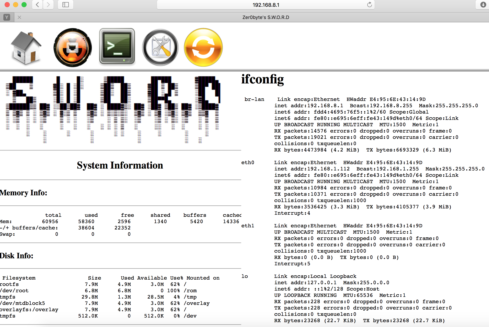

# openwrt_sdword #
## 基于SDWORD项目，对GL-AR150系列的路由做了一些修改 ##

- 原版本SWORD的地址：https://github.com/tomacwrt/tomacwrt.github.io/blob/master/SWORD.zip
- Zer0byte的项目介绍：https://github.com/tomacwrt/tomacwrt.github.io/blob/master/sword.pdf

## 安装方法：##

- 将项目文件提取到路由器的/www目录中。
- 确保路由器已安装了bash，否则相关脚本将无法正常运行，例如opkg update; opkg install bash –force-depends。
- 给目录/cgi-bin分配655权限（chmod -R 655 /www/cgi-bin/*）。
- 设置完成之后，在浏览器中输入“yourrouterip/SWORD”并访问工具页面（192.168.8.1/SWORD）。
- 注意：请确保路由器使用opkg安装了ettercap-ng , reaver, tcpdump, urlsnarf, ettercap, nmap和mk3等工具。
